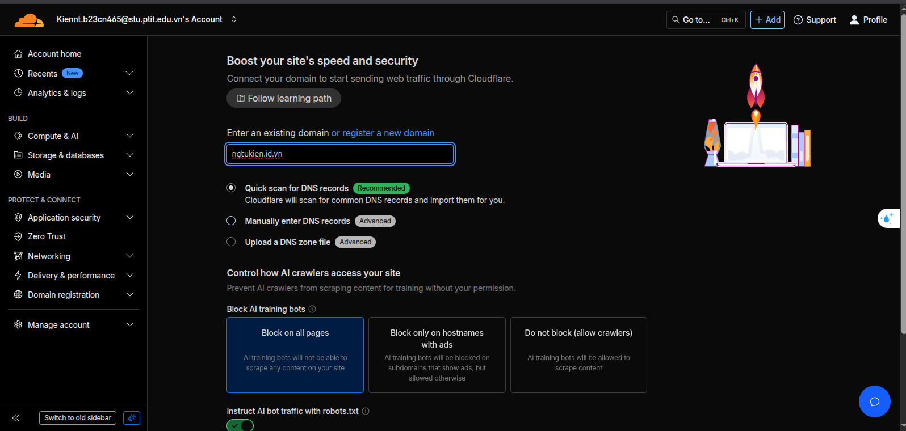
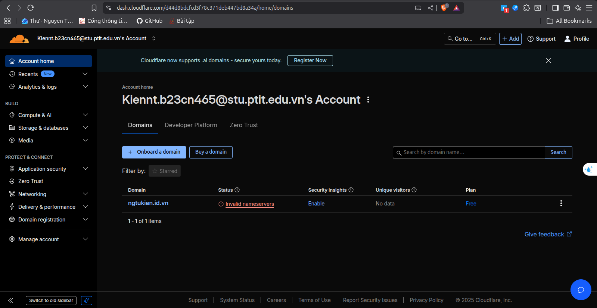
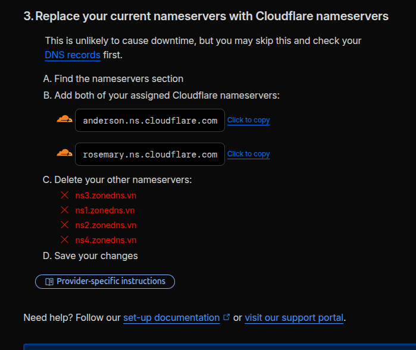
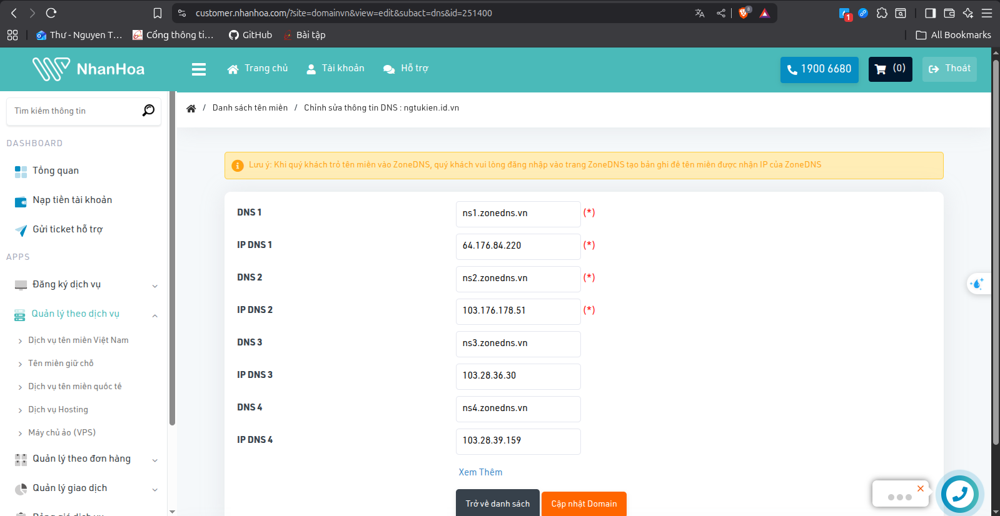
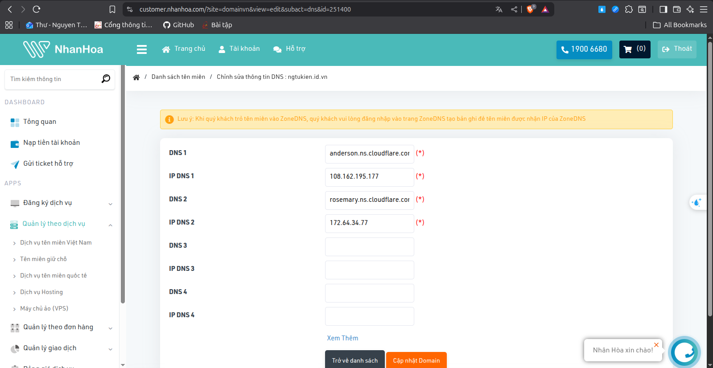
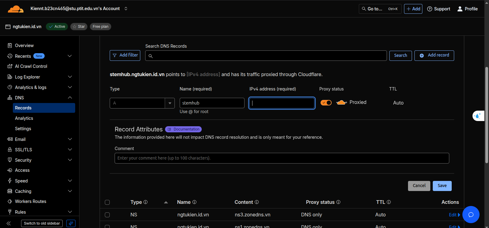
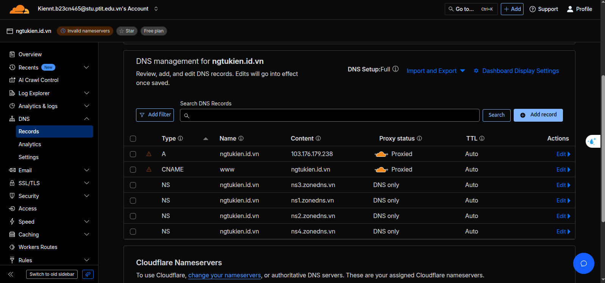
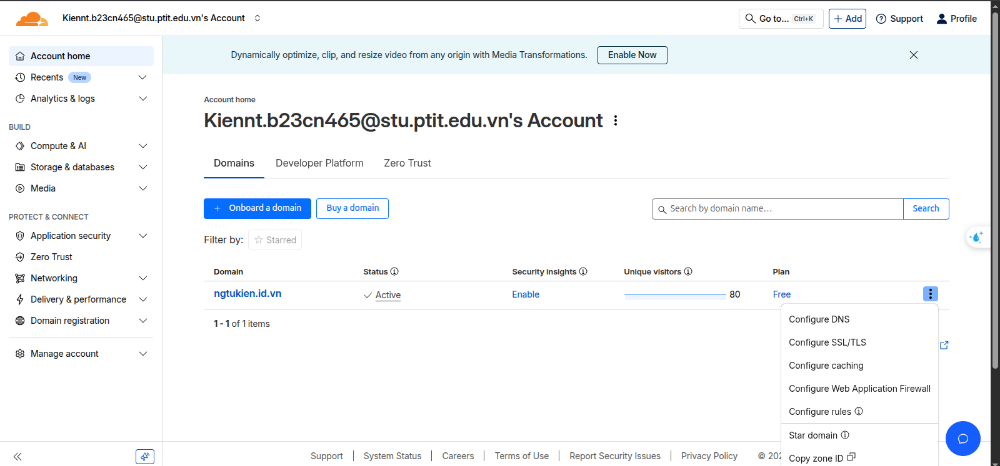
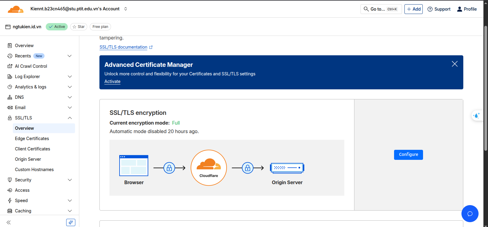
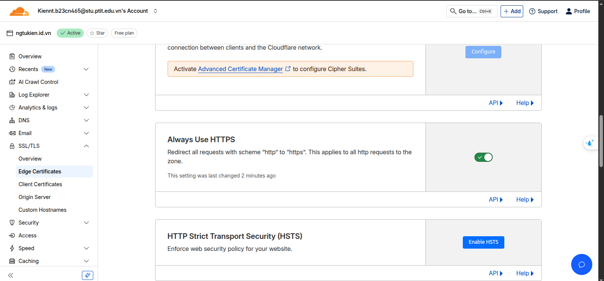

# Cloudflare Tunnel

-----
## 1. Nguyên lý hoạt động (Khái niệm)
Để hiểu Cloudflare Tunnel, hãy so sánh nó với cách làm truyền thống (mở port).
### Cách truyền thống (Port Forwarding)
* **Luồng:** Người dùng -\> Internet -\> IP Nhà bạn (`123.45.67.89`) -\> Router -\> (Mở Port) -\> Máy chủ Tomcat (`192.168.1.100:8080`).
* **Vấn đề:**
  * **Lộ IP:** Bạn phải "la làng" IP công khai của nhà mình cho cả Internet.
  * **Mở Port:** Bạn phải "đục một lỗ" trên tường lửa (router), cho phép bất kỳ ai trên mạng "chọc" vào port đó. Rất nguy hiểm.
  * **IP Động:** IP nhà bạn thường thay đổi, bạn phải dùng thêm DDNS phức tạp.
### Cách của Cloudflare Tunnel (Reverse Proxy)
* **Luồng:** Cloudflare Tunnel đảo ngược hoàn toàn quy trình này. Thay vì *bị động* nhận kết nối, máy chủ của bạn *chủ động* tạo kết nối đi ra.
* **Nguyên lý chính:**
    1.  Bạn cài một "người đào hầm" (chương trình `cloudflared`) lên máy chủ Ubuntu.
    2.  `cloudflared` **chủ động** kết nối *đi ra* (giống như bạn duyệt web) đến 4 trung tâm dữ liệu Cloudflare gần nhất.
    3.  Nó tạo ra một **đường hầm mã hóa vĩnh viễn** *từ* máy chủ của bạn *đến* Cloudflare. Vì đây là kết nối *đi ra*, router của bạn sẽ cho phép mà không cần mở port.
    4.  Khi người dùng truy cập `stemhub.domain.com`, họ sẽ đi đến Cloudflare (vì bạn đã đổi Nameserver).
    5.  Cloudflare nhận yêu cầu, nhìn vào DNS và thấy: "À, tên miền này được quản lý bởi Tunnel ID `cc98...`".
    6.  Cloudflare gửi yêu cầu của người dùng **chui qua đường hầm** đã được mở sẵn.
    7.  `cloudflared` trên máy Ubuntu của bạn nhận được yêu cầu, đọc file `config.yml` và thấy: "Yêu cầu cho `stemhub...`, chuyển đến `http://localhost:8080`".
    8.  Nó gửi yêu cầu đến Tomcat, nhận phản hồi, và gửi ngược lại cho người dùng qua đường hầm.
* **Lợi ích:**
    * **Giấu IP 100%:** IP nhà bạn an toàn tuyệt đối.
    * **Không mở Port:** Router của bạn "đóng kín", cực kỳ an toàn.
    * **Không cần DDNS:** IP nhà bạn thay đổi thoải mái, `cloudflared` sẽ tự động kết nối lại.
    * **Miễn phí HTTPS:** Cloudflare tự lo "ổ khóa bảo mật".
-----
## 2. Tổng hợp các bước cài đặt chi tiết (với domain name đã có )
Đây là các bước tôi đã làm, được sắp xếp lại theo trình tự chuẩn.
### Bước 1: Ủy quyền Tên miền cho Cloudflare
**Mục tiêu:** Nói với cả thế giới rằng "Muốn tìm `domain.com`, hãy hỏi Cloudflare".
1.  **Đăng ký Cloudflare:** Tạo tài khoản miễn phí.
2.  **Thêm Trang (Add Site):** Nhấn "+ Add Site", nhập `domain.com`.



3.  **Lấy Nameserver (NS):** Cloudflare sẽ cho bạn 2 NS (ví dụ: `anderson.ns.cloudflare.com` và `rosemary.ns.cloudflare.com`).



4.  **Cập nhật tại nơi thuê/mua tên miền:** Tìm quản lý DNS của `domain.com`. Xóa 4 NS cũ của `zonedns.vn` và **thay thế** bằng 2 NS của Cloudflare.



5.  **Chờ "Active":** Đợi vài phút đến vài giờ, cho đến khi Cloudflare báo tên miền của bạn đã **"Active"**.


### Bước 2: Cài đặt "Người đào hầm" trên Ubuntu
**Mục tiêu:** Cài đặt phần mềm `cloudflared` lên máy chủ của bạn.
1.  **Tải gói:**
    ```bash
    wget https://github.com/cloudflare/cloudflared/releases/latest/download/cloudflared-linux-amd64.deb
    ```
2.  **Cài đặt:**
    ```bash
    sudo dpkg -i cloudflared-linux-amd64.deb
    ```
### Bước 3: Đăng ký và Tạo Đường hầm (Tunnel)
**Mục tiêu:** "Giới thiệu" máy chủ của bạn với Cloudflare và lấy "chìa khóa".
1.  **Đăng nhập (Login):**
    ```bash
    cloudflared tunnel login
    ```
    * **Nguyên lý:** Lệnh này yêu cầu Cloudflare xác thực bạn. Nó sẽ cho bạn một link. Bạn mở link này trên trình duyệt, đăng nhập, và chọn tên miền `domain.com`. Cloudflare sẽ cấp một "chứng chỉ" (`cert.pem`) lưu vào máy Ubuntu của bạn (tại `~/.cloudflared/`) để chứng minh máy này thuộc về bạn.
2.  **Tạo Tunnel (Create):**
    ```bash
    cloudflared tunnel create <TÊN_TUNNEL>
    ```
    * **Nguyên lý:** Lệnh này "đăng ký" một đường hầm vĩnh viễn với Cloudflare. Cloudflare sẽ trả về 2 thứ:
        1.  **UUID** (Ví dụ: `cc98ebb3...`): Đây là tên định danh duy nhất cho đường hầm.
        2.  **File JSON** (Ví dụ: `cc98ebb3....json`): Đây là "chìa khóa riêng" của đường hầm, dùng để xác thực.
### Bước 4: Cấu hình Đường hầm (Quan trọng nhất)
**Mục tiêu:** Chỉ cho `cloudflared` biết:
1.  Nó là ai (dùng chìa khóa nào).
2.  Nó phải làm gì khi có traffic (trỏ đến `localhost:8080`).
3.  **Chuyển Chìa khóa (Sửa lỗi Quyền):**
    ```bash
    sudo cp /home/ngvana/.cloudflared/cc98...json /etc/cloudflared/
    ```
    * **Nguyên lý:** Đây là bước cực kỳ quan trọng mình đã gặp phải. Dịch vụ `cloudflared` sẽ chạy dưới quyền hệ thống (`root` hoặc `systemd`), không phải quyền `user`. Vì lý do bảo mật, nó *không thể* đọc file trong `/home/ngvana`. Bằng cách copy file JSON vào `/etc/cloudflared/`, chúng ta đặt chìa khóa ở nơi mà dịch vụ hệ thống được phép đọc.
4.  **Viết file Cấu hình:**
    ```bash
    sudo nano /etc/cloudflared/config.yml
    ```
    Dán nội dung chính xác này vào (thay `cc98...` bằng UUID của bạn):
    ```yaml
    # 1. UUID của tunnel
    tunnel: <UUID CỦA TUNNEL>

    # 2. Đường dẫn chìa khóa (đã copy)
    credentials-file: <ĐƯỜNG DẪN FILE JSON>

    # 3. Chỉ dẫn
    ingress:
      # Chỉ dẫn 1: Nếu ai gọi stemhub...
      - hostname: stemhub.domain.com
        # ...thì chuyển đến Tomcat
        service: http://localhost:8080
      
      #Chỉ dẫn 2: ....
      
      # Chỉ dẫn cuối: Nếu gọi bất cứ tên nào khác (như domain.com)
      # thì báo lỗi 404
      - service: http_status:404
    ```
### Bước 5: Kích hoạt (Go Live\!)
**Mục tiêu:** Trỏ DNS trên Cloudflare và khởi động dịch vụ.


1.  **Dọn dẹp DNS (Trên Cloudflare):**
    * Đăng nhập Cloudflare -\> DNS -\> Records.
    * **Xóa** tất cả các bản ghi `A` hoặc `CNAME` cũ cho `stemhub.domain.com` và `domain.com` (nếu có).
    * **Nguyên lý:** Lỗi "record already exists" xảy ra vì bạn không thể vừa có bản ghi `A` (trỏ IP) vừa muốn dùng Tunnel (trỏ CNAME) cho cùng một tên. Phải xóa cái cũ trước.
2.  **Trỏ DNS (Trên Terminal Ubuntu):**
    ```bash
    cloudflared tunnel route dns ngvana-tunnel stemhub.domain.com
    ```
    * **Nguyên lý:** Lệnh này tự động tạo một bản ghi `CNAME` đặc biệt trên Cloudflare, trỏ `stemhub.domain.com` vào "cửa vào" của đường hầm (`cc98....cfargotunnel.com`).
3.  **Chạy Dịch vụ:**
    ```bash
    # Cài đặt dịch vụ để chạy nền
    sudo cloudflared service install

    # Khởi động "người đào hầm"
    sudo systemctl start cloudflared
    ```
    * **Nguyên lý:** Lệnh `start` bảo "người đào hầm" bắt đầu kết nối *đi ra* Cloudflare. Lệnh `enable` đảm bảo nó luôn làm vậy, kể cả khi bạn reboot máy.
### Bước 6: Bật HTTPS (Ổ khóa bảo mật)
**Mục tiêu:** Tự động chuyển hướng sang `https://` và có ổ khóa xanh.
1.  Vào Cloudflare, chọn `domain` bạn muốn config, chọn **Configure SSL/TLS**.


2.  Chọn **"Full"** (Đầy đủ).


3.  Vào tab **SSL/TLS** -\> **Edge Certificates**.
4.  Bật **"Always Use HTTPS"** (Luôn sử dụng HTTPS).



**Xong\!** Bạn đã public ứng dụng Tomcat của mình ra Internet một cách an toàn nhất.
